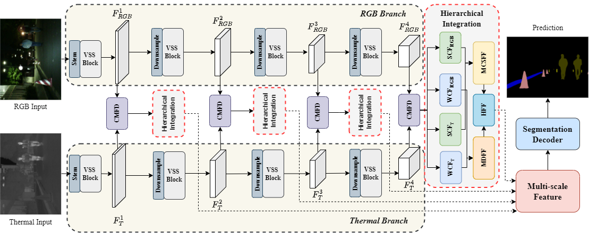

<div align="center">
<h1> CFDHI-Net: Correlation-driven Feature Decoupling and Hierarchical Integration Network for RGB-Thermal Semantic Segmentation </h1>


</div>


## 1.Introduction

This repository contains the code for our paper `CFDHI-Net: Correlation-driven Feature Decoupling and Hierarchical Integration Network for RGB-Thermal Semantic Segmentation`



## 2.Environment

We deploy our code with `PyTorch 2.0.0 + CUDA 11.8`.

Install Mamba
 ```shell
  cd models/encoders/selective_scan && pip install . && cd ../../..
 ```

## 3.Setup

### Datasets

 We use three datasets, including both RGB-Thermal and RGB-Depth datasets:
    - [RGB-Thermal MFNet](https://github.com/haqishen/MFNet-pytorch)
    - [RGB-Thermal PST900](https://github.com/ShreyasSkandanS/pst900_thermal_rgb)
    - [RGB-Depth NYU Depth V2](https://cs.nyu.edu/~silberman/datasets/nyu_depth_v2.html)


## 4.Usage

### Training
1. You can download the pretrained VMamba weights:

    - [VMamba_Tiny](https://drive.google.com/file/d/1W0EFQHvX4Cl6krsAwzlR-VKqQxfWEdM8/view?usp=drive_link).
    - [VMamba_Small](https://drive.google.com/file/d/1671QXJ-faiNX4cYUlXxf8kCpAjeA4Oah/view?usp=drive_link).
    - [VMamba_Base](https://drive.google.com/file/d/1qdH-CQxyUFLq6hElxCANz19IoS-_Cm1L/view?usp=drive_link).

    <u> Please put them under `pretrained/vmamba/`. </u>


2. Config setting.

    Edit config file in the `configs` folder.    
    Change C.backbone to `vmamba_tiny` / `vmamba_small` / `vmamba_base` to use the three versions of vmamba. 

3. Run multi-GPU distributed training:

    ```shell
    NCCL_P2P_DISABLE=1 CUDA_VISIBLE_DEVICES="0,1,2,3" python -m torch.distributed.launch --nproc_per_node=4  --master_port 29502 train.py -p 29502 -d 0,1,2,3 -n "dataset_name"
    ```

    Here, `dataset_name=mfnet/pst/nyu/sun`, referring to the four datasets.

4. You can also use single-GPU training:

    ```shell
    CUDA_VISIBLE_DEVICES="0,1,2,3,4,5,6,7" torchrun -m --nproc_per_node=1 train.py -p 29501 -d 0 -n "dataset_name" 
    ```
5. Results will be saved in `log_final` folder.


### Evaluation
1. Run the evaluation by:

    ```shell
    CUDA_VISIBLE_DEVICES="0,1,2,3,4,5,6,7" python eval.py -d="0" -n "dataset_name" -e="epoch_number" -p="visualize_savedir"
    ```

    Here, `dataset_name=mfnet/pst/nyu`, referring to the three datasets.\
    `epoch_number` refers to a number standing for the epoch number you want to evaluate with.

2. Results will be saved in `log_final` folder.

## 5.Results

We provide our trained weights on the MFNet dataset and PST-900:

### MFNet (9 categories)
| CFDHI-Net | VMamba-T | 61.5% | [checkpoint](https://pan.baidu.com/s/1TvX6T3QkFf2nNa3cUL_Ujg?pwd=8brs) |

### PST900 (5 categories)
| CFDHI-Net | VMamba-T | 87.3% | [checkpoint](https://pan.baidu.com/s/1ocG0-gyTJy3oS0dlDop93w?pwd=a4gc) |

## 📌 Citation

If you find this code useful, please consider citing our work:

```bibtex
@ARTICLE{11059996,
  author={Chen, Haojie and Wang, Zhuo and Qin, Hongde and Mu, Xiaokai},
  journal={IEEE Transactions on Intelligent Transportation Systems}, 
  title={CFDHI-Net: Correlation-Driven Feature Decoupling and Hierarchical Integration Network for RGB-Thermal Semantic Segmentation}, 
  year={2025},
  volume={},
  number={},
  pages={1-12},
  keywords={Feature extraction;Semantic segmentation;Correlation;Transformers;Accuracy;Decoding;Convolution;Computational complexity;Intelligent transportation systems;Convolutional neural networks;RGB-T semantic segmentation;correlation-driven feature decoupling;hierarchical feature fusion;dual-branch VMamba backbone},
  doi={10.1109/TITS.2025.3581609}}
```


## Acknowledgements

Our codes are based on [Sigma](https://github.com/zifuwan/Sigma) and [CMX](https://github.com/huaaaliu/RGBX_Semantic_Segmentation). The Mamba codes are adapted from [Mamba](https://github.com/state-spaces/mamba) and [VMamba](https://github.com/MzeroMiko/VMamba). We appreciate the outstanding contributions of these methods.


